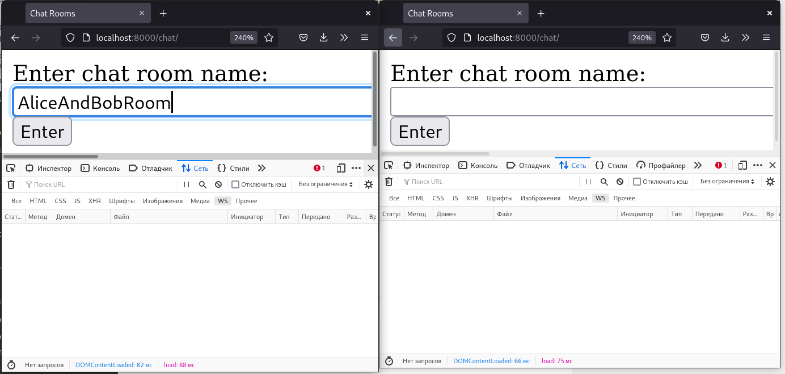
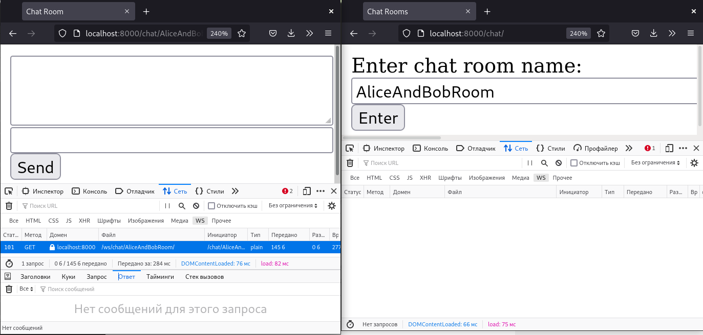
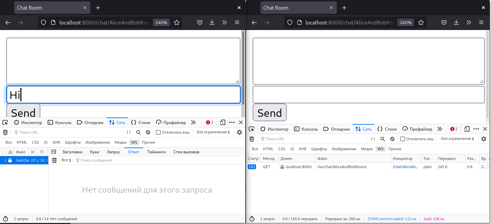
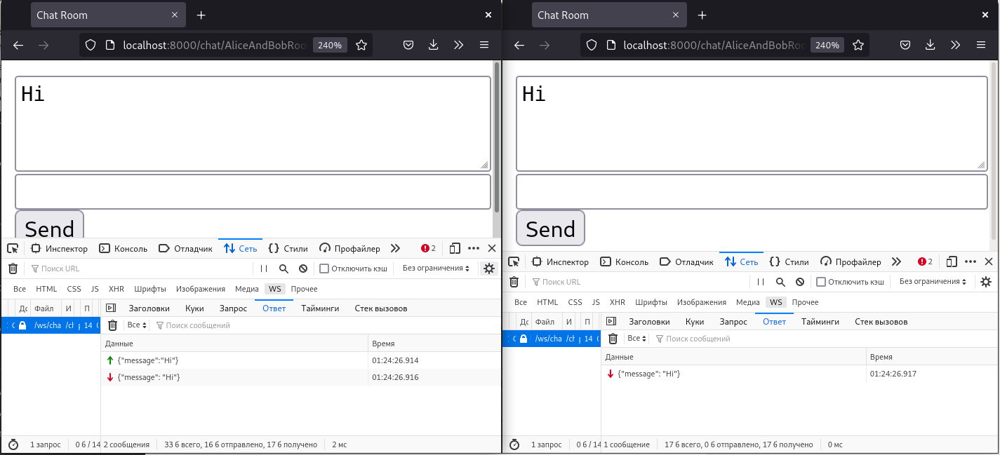
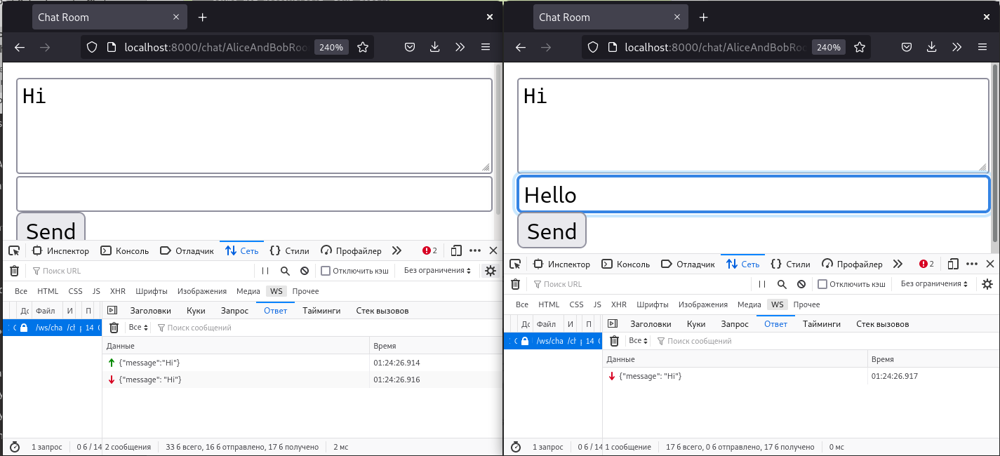
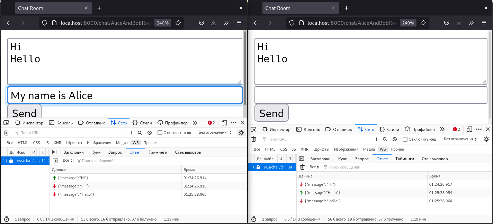

# Django - WebSocket via Channels

Redesigned base example https://channels.readthedocs.io/en/stable/tutorial/index.html without any database. Just enter room name and start chat.

```shell
python3.8 manage.py runserver
```

```shell
HTTP GET /chat/AliceAndBobRoom/ 200 [0.01, 127.0.0.1:55584]
WebSocket HANDSHAKING /ws/chat/AliceAndBobRoom/ [127.0.0.1:55588]
WebSocket CONNECT /ws/chat/AliceAndBobRoom/ [127.0.0.1:55588]
```











